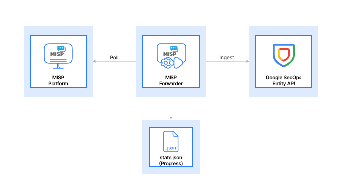

# MISP to Google SecOps Forwarder

A production-ready integration that continuously synchronizes threat intelligence from **[MISP (Malware Information Sharing Platform)](https://www.misp-project.org/)** to Google Security Operations (SecOps), enabling real-time threat detection and correlation.

## Table of Contents

- [Overview](#overview)
- [Platform Introduction](#platform-introduction)
- [Architecture](#architecture)
- [Prerequisites](#prerequisites)
- [Installation](#installation)
- [Configuration](#configuration)
- [Deployment](#deployment)
- [Runtime Management](#runtime-management)
- [Monitoring](#monitoring)
- [Troubleshooting](#troubleshooting)

---

## Overview

This forwarder bridges the gap between MISP threat intelligence and Google SecOps SIEM, automatically ingesting Indicators of Compromise (IoCs) as Entity Context for real-time detection and alerting.

### Key Features

- **Continuous Synchronization**: Polls MISP at configurable intervals
- **Entity Context Ingestion**: IoCs stored as searchable entities in SecOps

- **Runtime Configuration**: Update settings without container restart
- **Narrative Logging**: Human-readable status updates
- **State Persistence**: Tracks progress to avoid duplicate ingestion
- **Docker-First**: Production-ready containerized deployment

---

## Platform Introduction

### What is MISP?

**[MISP (Malware Information Sharing Platform)](https://www.misp-project.org/)** is an open-source threat intelligence platform designed for:

- Collecting, storing, and sharing threat indicators
- Collaborative threat intelligence sharing across organizations
- Automated correlation and enrichment of IoCs
- Integration with security tools via REST API

**Common Use Cases:**

- Centralized threat intelligence repository
- Information sharing communities (ISACs, CERTs)
- Threat hunting and incident response

### What is Google Security Operations (SecOps)?

**Google SecOps** (formerly Chronicle) is a cloud-native SIEM platform that provides:

- Petabyte-scale log ingestion and retention
- Real-time threat detection and correlation
- Entity-based threat intelligence matching
- Advanced threat hunting with YARA-L rules

**Entity Context in SecOps:**
When IoCs are ingested as Entity Context, they:

- Remain active for a configurable time window (default: 90 days)
- Trigger instant "IoC Match" alerts when seen in telemetry
- Enable retroactive hunting in historical data
- Correlate across all ingested security logs

---

## Architecture



### Data Flow

1. **Fetch**: Poll MISP `/attributes/restSearch` for new IoCs
2. **Transform**: Convert MISP attributes to SecOps Entity format
3. **Ingest**: Send batches to SecOps Entity API
4. **Track**: Update `state.json` with last processed timestamp
5. **Repeat**: Sleep for configured interval, then loop

---

## Prerequisites

### Required Accounts & Access

1. **MISP Instance**
   - **Obtaining an instance (if needed):**
     - [MISP Docker](https://github.com/MISP/misp-docker/blob/master/README.md) (Recommended for quick setup)
     - [Manual Installation Guide](https://misp.github.io/MISP/)
   - **Access Requirements (Once instance is ready):**
     - URL and API key with read access
     - Network connectivity from deployment environment

2. **Google Cloud Project**
   - SecOps instance provisioned
   - Service Account with `Chronicle API` role
   - Customer ID from SecOps admin console

3. **Deployment Environment**
   - Docker and Docker Compose installed
   - Linux host (tested on Ubuntu 20.04+)
   - Network access to both MISP and Google APIs

### Required Files

- `credentials.json` - Google Service Account key
- `config.json` - Application configuration
- `.env` - Environment variables
- `assets/custom.png` - Startup banner image (optional)

---

## Installation

### Step 1: Clone or Download

```bash
cd /path/to/your/workspace
# If using git:
git clone <repository-url> misp-secops-forwarder
cd misp-secops-forwarder

# Or extract from archive:
unzip misp-secops-forwarder.zip
cd misp-secops-forwarder
```

### Step 2: Obtain Google Service Account Credentials

1. Go to [Google Cloud Console](https://console.cloud.google.com)
2. Navigate to **IAM & Admin > Service Accounts**
3. Create or select a service account with SecOps permissions
4. Click **Keys > Add Key > Create New Key**
5. Choose **JSON** format
6. Save as `credentials.json` in the project root

### Step 3: Get Your SecOps Customer ID

1. Log into [Google SecOps Console](https://chronicle.security)
2. Navigate to **Settings > API Access**
3. Copy your **Customer ID** (format: `xxxxxxxx-xxxx-xxxx-xxxx-xxxxxxxxxxxx`)

### Step 4: Get Your MISP API Key

1. Log into your MISP instance
2. Navigate to **Administration > List Auth Keys**
3. Copy your API key or create a new one

---

## Configuration

### Environment Variables (.env)

Create a `.env` file in the project root:

```bash
# MISP Configuration
MISP_URL=https://your-misp-instance.com
MISP_API_KEY=your_misp_api_key_here
MISP_VERIFY_SSL=false

# Google SecOps Configuration
GOOGLE_SA_CREDENTIALS=/app/credentials.json
GOOGLE_CUSTOMER_ID=your-customer-id-here
GOOGLE_PROJECT_ID=your-gcp-project-id

# SecOps API URLs (required)
SECOPS_ENTITY_API_URL=https://malachiteingestion-pa.googleapis.com/v2/entities:batchCreate
SECOPS_UDM_API_URL=https://malachiteingestion-pa.googleapis.com/v2/udmevents:batchCreate

```

### Application Configuration (config.json)

The repository includes a `config.json` file with default settings. You can review and modify it as needed:

```json
{
  "FETCH_INTERVAL": 3600,
  "FETCH_PAGE_SIZE": 100,
  "FORWARDER_BATCH_SIZE": 100, // Max recommended 500 (API Limit: 4MB)
  "IOC_EXPIRATION_DAYS": 30,
  "TEST_MODE": false,
  "MAX_TEST_EVENTS": 3,
  "HISTORICAL_POLLING_DATE": 7,
  "LOG_LEVEL": "INFO"
}
```

**Configuration Priority:**

1. CLI arguments (highest)
2. `config.json` file
3. Built-in defaults (lowest)

---

## Deployment

### Using Docker Compose (Recommended)

1. **Build the image:**

   ```bash
   docker compose build
   ```

2. **Start the forwarder:**

   ```bash
   docker compose up -d
   ```

3. **View logs:**

   ```bash
   docker compose logs -f
   ```

4. **Stop the forwarder:**
   ```bash
   docker compose down
   ```

### Using Docker Run (Alternative)

```bash
# Build
docker build -t misp-forwarder .

# Run
docker run -d \
  --name misp-secops-forwarder \
  --network host \
  --env-file .env \
  -v "$(pwd)/credentials.json:/app/credentials.json" \
  -v "$(pwd)/misp_data:/app/data" \
  -v "$(pwd)/config.json:/app/config.json" \
  -v "$(pwd)/assets/custom.png:/app/assets/custom.png" \
  misp-forwarder --config /app/config.json
```

### First Run Verification

After starting, check logs for:

```
✓ Metron Security banner display
✓ "Successfully established a secure connection to MISP"
✓ "Configuration loaded from /app/config.json"
✓ "Entering routine monitoring loop"
```

---

## Runtime Management

### Configuration Commands

**List all current settings:**

```bash
docker exec misp-secops-forwarder python manage.py list
```

**Get a specific value:**

```bash
docker exec misp-secops-forwarder python manage.py get FORWARDER_BATCH_SIZE
```

**Update configuration values:**

```bash
# Change batch size to 200 (Safety limit: 500)
docker exec misp-secops-forwarder python manage.py set FORWARDER_BATCH_SIZE 200

# Change fetch interval to 30 minutes (1800 seconds)
docker exec misp-secops-forwarder python manage.py set FETCH_INTERVAL 1800

# Change page size to 50
docker exec misp-secops-forwarder python manage.py set FETCH_PAGE_SIZE 50

# Set historical polling to 14 days
docker exec misp-secops-forwarder python manage.py set HISTORICAL_POLLING_DATE 14

# Enable test mode
docker exec misp-secops-forwarder python manage.py set TEST_MODE true

# Set max test events
docker exec misp-secops-forwarder python manage.py set MAX_TEST_EVENTS 5

# Set IoC expiration days
docker exec misp-secops-forwarder python manage.py set IOC_EXPIRATION_DAYS 90

# Change log level to DEBUG
docker exec misp-secops-forwarder python manage.py set LOG_LEVEL DEBUG

# Change log level back to INFO
docker exec misp-secops-forwarder python manage.py set LOG_LEVEL INFO


```

**How it works:**

1. The `manage.py` command updates `config.json`
2. The running application detects the file change immediately
3. The current process is gracefully terminated
4. A new process is automatically started with the new configuration
5. **No container restart required!**

### Configuration Update Behavior

When a configuration change is detected (via `manage.py` or direct file edit):

- **Detection**: The system monitors `config.json` for modification events.
- **Termination**: The active worker loop is interrupted, and the current process state is cleared.
- **Restart**: The application re-initializes all client connections and reloads settings.
- **Logging**: You will see specific logs indicating this lifecycle transition:
  ```
  Configuration updated
  Previous process terminated
  Application restarted with new configuration
  ```

### Reset Historical Sync

You can reset the synchronization start time to a specific point in the past by updating `HISTORICAL_POLLING_DATE`.

**Using Runtime Configuration:**

Updating this value via `manage.py` will automatically trigger a resync from the new date, resetting the current progress.

```bash
# Reset sync to look back 30 days from now
docker exec misp-secops-forwarder python manage.py set HISTORICAL_POLLING_DATE 30

# Reset sync to a specific date
docker exec misp-secops-forwarder python manage.py set HISTORICAL_POLLING_DATE 2024-01-01
```

**Note:** This will overwrite the current progress in `state.json` and start fetching from the new timestamp forward.

---

## Monitoring

### Health Checks

**Check if container is running:**

```bash
docker ps | grep misp-secops-forwarder
```

**View real-time logs:**

```bash
docker logs -f misp-secops-forwarder
```

**Check last 100 lines:**

```bash
docker logs --tail=100 misp-secops-forwarder
```

### Key Log Messages

**Successful sync:**

```
The application successfully retrieved X new attributes from MISP
The application successfully transformed X of them into valid threat entities
The threat data has been successfully delivered and ingested into Google SecOps
```

**Configuration reload:**

```
Configuration file has been modified. Reloading settings...
Configuration reloaded successfully. New batch size: 200, Fetch interval: 1800s
```

**No new data:**

```
No new threat indicators were found during this check
```

### View Logs

**Step 1: Enable DEBUG logging**

```bash
docker exec misp-secops-forwarder python manage.py set LOG_LEVEL DEBUG
```

**Step 2: View real-time logs (all levels)**

```bash
# View all logs in real-time
docker logs -f misp-secops-forwarder

# View last 100 lines
docker logs --tail=100 misp-secops-forwarder

# View logs since a specific time
docker logs --since 10m misp-secops-forwarder

# View logs with timestamps
docker logs -f --timestamps misp-secops-forwarder
```

**Step 3: Filter logs by level**

```bash
# Show only INFO messages
docker logs misp-secops-forwarder | grep "INFO"

# Show only DEBUG messages
docker logs misp-secops-forwarder | grep "DEBUG"

# Show ERROR and WARNING messages
docker logs misp-secops-forwarder | grep -E "ERROR|WARNING"
```

**Step 4: Save logs to file**

```bash
# Save all logs to file
docker logs misp-secops-forwarder > forwarder_logs.txt

# Save last 1000 lines
docker logs --tail=1000 misp-secops-forwarder > recent_logs.txt
```

### Verify in Google SecOps

1. Log into [SecOps Console](https://chronicle.security)
2. Navigate to **Investigation > SIEM Search**
3. Query for recent MISP entities:
   ```
   graph.entity.hostname = "hostname"
   graph.metadata.product_name = "MISP"
   ```

> [!NOTE]
> It can take some time (typically **2 to 4 hours**) for new indicators to be fully processed and for matches to appear in the **IOC Matches** view. Google SecOps periodically correlates security telemetry against ingested threat intelligence.

---

## Testing

### Generate UDM Event for IoC Match Testing

The `simulate_match.py` script generates a UDM event to test if your IoCs are triggering matches in SecOps.

**What it does:**

1. Prompts you to enter an IoC value (IP, domain, URL, or file hash)
2. Generates a realistic UDM event containing that IoC
3. Sends the event to SecOps UDM API
4. The event should trigger an IoC match if the entity exists in SecOps

**Run the test:**

```bash
# Run interactively
docker exec -it misp-secops-forwarder python tests/simulate_match.py
```

**Example session:**

```
UDM Event Generator for IoC Match Testing
==================================================

Enter IoC details to generate a matching UDM event:

Supported types:
  1. IP address (e.g., 192.168.1.100)
  2. Domain/Hostname (e.g., malicious.com)
  3. URL (e.g., http://malicious.com/path)
  4. File hash (MD5/SHA1/SHA256)

Select type (1-4): 2
Enter IoC value: malicious.com

Generating event for domain: malicious.com
Sending UDM event to Google SecOps...

✓ UDM Event Sent Successfully!
```

### Verify Test Results in SecOps

1. Log into [Google SecOps Console](https://chronicle.security)
2. Navigate to **Alerts > IoC Matches**
3. Look for a recent match with:
   - **IoC Value**: The domain/IP from the test
   - **Source**: MISP
   - **Timestamp**: Within the last few minutes

> **Note:** IoC matching in Google SecOps may take **5-15 minutes** to appear after ingestion due to indexing and correlation processing. For large batches, allow up to 30 minutes. This is normal behavior for the platform's distributed architecture. For more information, refer to the [Google SecOps Entity API documentation](https://cloud.google.com/chronicle/docs/reference/ingestion-api).

### Unit Tests

**Test configuration loading:**

```bash
docker exec misp-secops-forwarder python manage.py list
```

**Test MISP connectivity:**

```bash
docker exec misp-secops-forwarder python -c "
from src.misp.client import MispClient
misp = MispClient()
print('MISP Connection:', 'OK' if misp.test_connection() else 'FAILED')
"
```

**Test config reload:**

```bash
# Change a value
docker exec misp-secops-forwarder python manage.py set FETCH_INTERVAL 1800

# Wait for next sync cycle and check logs
docker logs misp-secops-forwarder | grep "Configuration reloaded"
```

---

## Troubleshooting

### Common Issues

**Problem: "Failed to connect to MISP"**

- Verify `MISP_URL` is correct and accessible
- Check `MISP_API_KEY` is valid
- If using self-signed certs, ensure `MISP_VERIFY_SSL=false`
- Test connectivity: `curl -k https://your-misp-url/servers/getVersion`

**Problem: "Unable to load Google Service Account credentials"**

- Verify `credentials.json` exists and is mounted correctly
- Check file permissions: `chmod 644 credentials.json`
- Validate JSON syntax: `cat credentials.json | jq .`

**Problem: "Failed to ingest entities" (403/401)**

- Verify Service Account has SecOps API permissions
- Check `GOOGLE_CUSTOMER_ID` is correct
- Ensure `SECOPS_ENTITY_API_URL` is correct

**Problem: Container exits immediately**

- Check logs: `docker compose logs misp-secops-forwarder`
- Verify all required env variables are set
- Test config: `docker exec misp-secops-forwarder python manage.py list`

**Problem: Configuration changes not applying**

- Verify `config.json` is mounted as a volume
- Check file modification time: `docker exec misp-secops-forwarder ls -l /app/config.json`
- Wait for next sync cycle (check `FETCH_INTERVAL`)

### Debug Mode

Enable verbose logging using the runtime configuration:

```bash
# Enable DEBUG logging
docker exec misp-secops-forwarder python manage.py set LOG_LEVEL DEBUG

# View logs to see debug output
docker logs -f misp-secops-forwarder

# Switch back to INFO when done
docker exec misp-secops-forwarder python manage.py set LOG_LEVEL INFO
```

**Valid log levels:** DEBUG, INFO, WARNING, ERROR, CRITICAL

### Reset State

To start fresh (re-process all data):

```bash
# Stop container
docker compose down

# Remove state file
rm -rf misp_data/state.json

# Restart
docker compose up -d
```

---

## Advanced Topics

### Custom Banner

Replace `assets/custom.png` with your own image. The application uses `chafa` to render it as ASCII art on startup.

### Production Deployment

**Recommendations:**

- Set `TEST_MODE=false`
- Use `FETCH_INTERVAL=3600` (1 hour) or higher
- Enable SSL verification: `MISP_VERIFY_SSL=true`
- Monitor disk usage for `misp_data/` volume
- Set up log rotation for Docker logs
- Use Docker health checks in production orchestration

### Scaling Considerations

- **Batch Size**: Increase `FORWARDER_BATCH_SIZE` for high-volume environments (Strictly limited/capped at 500 to prevent 4MB API overflow).
- **Fetch Interval**: Decrease for near-real-time sync (minimum: 300s)
- **Page Size**: Increase `FETCH_PAGE_SIZE` if MISP has many attributes per sync

---

## Support & Contributing

For issues, questions, or contributions, please refer to the project repository:
@
